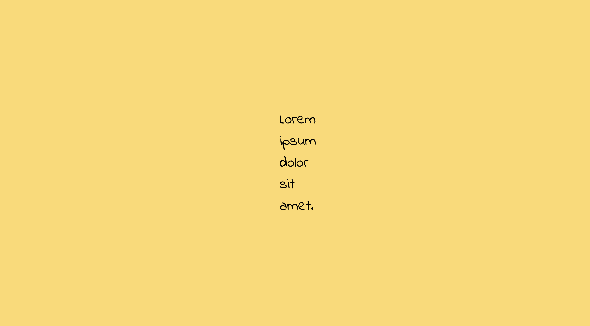
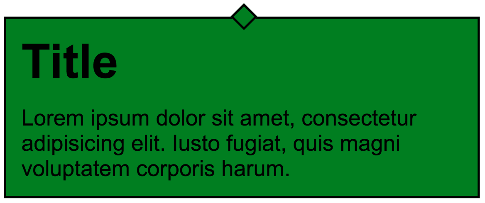
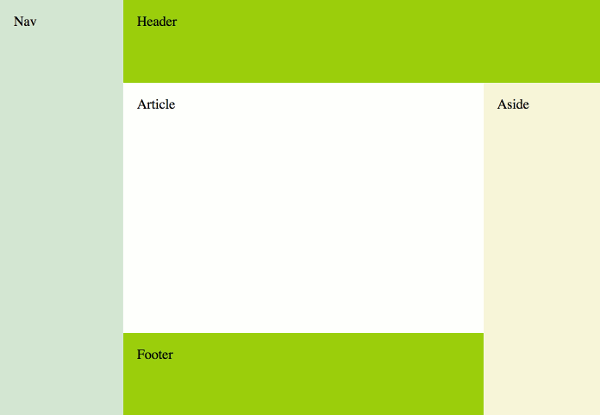
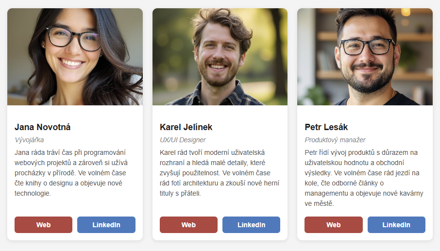

## Jak začít?

1. [*Forkni*](https://guides.github.com/activities/forking/) tento repozitář obsahující připravené úkoly.
2. *Naklonuj* repozitář na svůj počítač pomocí příkazu: `git clone adresa_repozitáře`.
   Adresu repozitáře najdeš po kliknutí na zelené tlačítko „Code" na jeho webové stránce.
3. Dokonči cvičení a udělej *commit* změn, jak jsi zvyklý/. Buď pomocí rozhraní ve VS Code nebo pomocí příkazů na příkazovém řádku.
4. Ideálně dělej *commit* po dokončení každého cvičení.
5. Nezapomeň commitnuté změny synchronizovat na GitHub.
6. Vytvoř [*pull request*](https://help.github.com/articles/creating-a-pull-request) do původního repozitáře, až dokončíš všechna cvičení.

## Instalace a spuštění cvičení

Po naklonování repozitáře k sobě na počítač udělej následující:
1. Spusť příkaz  `npm install`, aby se ti všechny nástroje potřebné pro spuštění cvičení.
2. V souboru *vite.config.js* vždy odkomentuj řádek pro příslušné cvičení.
3. Spusť vývojový server příkazem `npm run start` nebo na paletce NPM Scripts ve VS Code.

---

## Úkol 1

Sekce `.centered-text` v HTML obsahuje element `p`. Nastav jeho šířku na `100px`. Vystřed ho svisle i vodorovně doprostřed sekce. Text by měl být třikrát větší než základní hodnota (použij jednotku `rem`).

Sekce:
- by měla mít barvu pozadí: `#FFDA69`, uloženou v CSS proměnné s názvem `gold`,
- šířku `100%`,
- výšku `100%`.

Do stránky přípoj z Google Fonts písmo „Indie Flower" s tloušťkou `400` a použij ho na celý dokument.

Do CSS přidej základní CSS reset a nastav všem prvkům `box-sizing` na hodnotu `border-box`.

## Úkol 2

Definuj v Sass tři barvy pomocí *Sass proměnných*:

* první proměnná s názvem `baseColor` – nastav její barvu na `#2325b8`,
* druhá proměnná s názvem `secondColor` – barva o **30 %** světlejší než základní barva,
* třetí proměnná s názvem `thirdColor` – barva o **40 %** tmavší než základní barva.

Pak tyto barvy nastav jako barvy rámečku (`5px solid`) u následujících sekcí:

- `section-1` – baseColor,
- `section-2` – secondColor,
- `section-3` – thirdColor.

## Úkol 3

Vytvoř mixin s názvem `dialogBox`, který přijímá dva argumenty – barvu (`$backgroundColor`) a šířku boxu (`$width`).

Úkolem mixinu je nastavit následující styly:

* šířka: na hodnotu `$width` předanou v parametru mixinu
* vnitřní odsazení: `10px`
* pozadí: na `$backgroundColor` předanou v parametru mixinu
* rámeček s tloušťkou `1px` a černou barvou
* vnější odsazení `40px` nahoře a dole, automatické po stranách

Do mixinu přidej pseudo-element **:after**, který vytvoří čtvereček o rozměrech `10px` × `10px` zdobící box. Čtvereček je napozicovaný uprostřed horní hrany boxu a je otočený o `45deg`.

Mixin použij ve třídě `dialog`.

Výsledný vzhled by měl vypadat takto:

## Úkol 4

V HTML souboru máš připravených 5 sekcí. Tvům úkolem je pomocí flexboxu dosáhnout rozložení jako na obrázku viz níže.

**DŮLEŽITÉ: aby šel tento úkol vyřešit, musíš výjimečně upravit i HTML kód a doplnit do něho další prvky.**

Nezapomeň, že flexboxů můžeš použít více a můžeš je vnořit do sebe.

Prvky budou roztažené přesně na celou šířku a výšku okna prohližeče.

- **Nav** a **Aside** jsou široké `20vw`.
- **Header** a **Footer** jsou vysoké `20vh`.
- Ostatní prvky se roztahují na zbývající šířku/výšku.

Výsledný vzhled by měl vypadat takto:

## Úkol 5

V HTML souboru je připravený kompletní kód kartiček pro 3 osoby.

Nastyluj kartičky tak, aby vypadaly jako na obrázcích víz níže.

Použij **mobile first** responzivní webdesign.

**Na mobilu** platí:
- kartičky jsou pod sebou a mezi nimi je `20px` mezera
- uvnitř kartičky je fotka vlevo a je široká `150px`
- obsah kartičky je vpravo a je roztažený na zbylou šířku
- mezi obrázkem a obsahem je `20px` mezera
- tlačítka jsou vedle sebe, obě tlačítka jsou stejně široká a je mezi nimi `10px` mezera

**Na desktopu** - platí pro `700px` a víc - budou kartičky:
- kartičky jsou vedle sebe, je mezi nimi `20px` mezera
- uvnitř kartičky je obrázek a obsah pod sebou

Barvy:
- pozadí #f4f4f4
- primární tlačítko #b94040
- sekundární tlačítko #3a7abf

